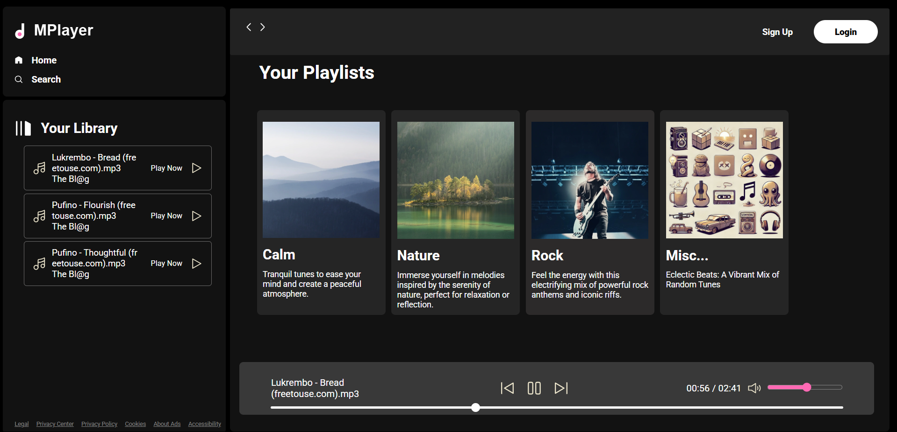

# MPlayer

MPlayer is a web-based music player designed with a sleek and dynamic user interface inspired by Spotify. This project is built using **HTML**, **CSS**, and **JavaScript**, with no backend included. It is made for educational purposes to demonstrate the functionality of a modern music player.

---

## Features

- **Play, Pause, Next, and Previous Controls**: Seamlessly navigate through songs in the playlist.
- **Mute and Volume Control**: Easily adjust or mute the audio.
- **Dynamic and Responsive Design**: Optimized to work across various devices and screen sizes.
- **Interactive UI**: Includes placeholders for hyperlinks that can be edited to suit your needs.
- **Comments in JavaScript**: Added for better code understanding and learning.

---

## Instructions

- **Songs:** I have'nt uploaded any songs. You may download any song, of your choice, and organise it.

---

## Resources Used

1. **Songs**: You are free to download and use any song of your choice.  
2. **Album Cover Images**: Retrieved from [FreeToUse.com](https://freetouse.com).  
3. **SVG Icons**: Retrieved from [Huge Icons](https://hugeicons.com).  
4. **Placeholders**: Some hyperlinks and sections are placeholders that can be updated.

---

## Purpose

This project was created to:

- Explore and demonstrate the core features of a music player.
- To learn, practice and improve knowledge about web devolepment and for Educational purpouses.
- Provide a learning resource for building interactive and responsive web applications.

---

## Additional Notes

- The application is highly dynamic, adapting to various devices.
- All major functionalities, such as play, pause, next, previous, mute, and volume control, have been implemented.
- This project does not include backend functionality.
- **Disclaimer**: The songs and album cover images used in this project are sourced from external websites. I do not own any of these songs or images, and they are included solely for demonstration purposes.

---

## How to Use

1. Clone or download the repository.
2. Open the `mplayer.html` file in your browser.
3. Browse through the playlist, play songs, and explore the controls.

---

## Acknowledgments

- Thanks to **Huge Icons** for providing the SVG icons.
- Thanks [FreeToUse.com](https://freetouse.com) for album cover resources.
- Special acknowledgment to **Code with Harry** for the tutorial that inspired this project. Check out his YouTube channel [here](https://www.youtube.com/@CodeWithHarry).

---

## Screenshot

---

## License

This project is licensed under the MIT License.
